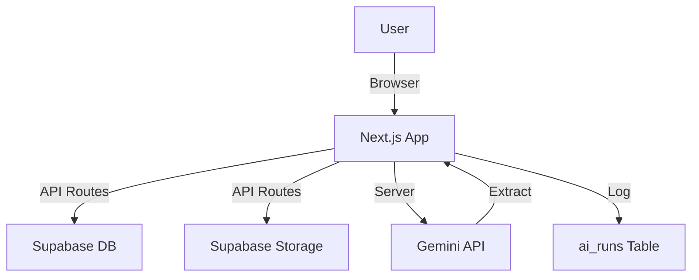

# Simple AI-Assisted Personal Job Tracker

Track job applications + files + AI extraction on a lightweight stack.


[](https://simple-job-tracker-ai.netlify.app)


<br/>

## 🔗 Live Demo & Repo

- **Production URL**: [https://simple-job-tracker-ai.netlify.app](https://simple-job-tracker-ai.netlify.app)
- **Repository**: [https://github.com/prudhvi1519/Simple-AI-Assisted-Personal-Job-Tracker](https://github.com/prudhvi1519/Simple-AI-Assisted-Personal-Job-Tracker)

<br/>

## ⚡ At a Glance

- **Smart Tracking**: Job CRUD with advanced optional fields (Priority, Work Mode, Compensation).
- **Status Workflow**: Custom statuses with auto-bump from "Saved" to "Applied" on upload.
- **File Management**: Upload Resumes and Descriptions securely to Supabase Storage.
- **AI Assist**: Extract details from raw JDs/URLs, Diff Preview, and Selective Apply.
- **Search & Filter**: Instant filtering by Status, Priority, and Work Mode.
- **Data Portability**: Full CSV/JSON exports + Manifest backup (Single Source of Truth).
- **Production Ready**: Built-in health checks for Environment, Storage, and Schema.
- **Mobile Optimized**: Responsive Card layouts and Drawer sidebars.

<br/>

## 📑 Table of Contents

- [Simple AI-Assisted Personal Job Tracker](#simple-ai-assisted-personal-job-tracker)
  - [🔗 Live Demo \& Repo](#-live-demo--repo)
  - [⚡ At a Glance](#-at-a-glance)
  - [📑 Table of Contents](#-table-of-contents)
  - [📦 Implementation Status (Summary)](#-implementation-status-summary)
  - [✨ Features](#-features)
  - [🛠️ Tech Stack](#️-tech-stack)
  - [🧱 Architecture](#-architecture)
  - [📦 Data Model](#-data-model)
  - [🔌 API Endpoints](#-api-endpoints)
  - [🚀 Quickstart (Local)](#-quickstart-local)
  - [🔐 Environment Variables](#-environment-variables)
  - [🗄️ Supabase Setup](#️-supabase-setup)
  - [📁 Storage Paths](#-storage-paths)
  - [🧠 AI Contract](#-ai-contract)
  - [📤 Export \& Backup](#-export--backup)
  - [✅ Health Checks](#-health-checks)
  - [🧰 Deployment (Netlify)](#-deployment-netlify)
  - [🧯 Troubleshooting](#-troubleshooting)
  - [📄 License](#-license)
  - [📚 Documentation Index](#-documentation-index)

<br/>

## 📦 Implementation Status (Summary)

**Current state:** ✅ Feature-complete MVP + mobile-ready + production verified.

**What’s implemented** (short bullets)
- Jobs CRUD + optional advanced fields (priority, work_mode, skills, follow-up, compensation, recruiter info, source)
- Files: resume/docs upload/download/delete (Supabase Storage)
- Status automation: resume upload bumps Saved→Applied only
- AI Assist: extract (JD text/URLs), diff preview, selective apply, strict “no guessing”
- Search + filters (status/priority/work_mode)
- Exports: CSV/JSON/manifest backup
- Guardrails: delete confirmations + health endpoints (env/storage/schema)
- Mobile UX: mobile cards + sidebar drawer

**Verification highlights**
- Prod health checks: `/api/health/env`, `/api/health/storage`, `/api/health/schema` all ok
- Jobs page loading: spinner-forever bug fixed

**Link to Full Pack**
📄 Full proof / regression logs / prompt history: [STATUS_PACK.md](./STATUS_PACK.md)

<br/>

## ✨ Features

### A) Jobs & Status

- **Rich Data**: Track more than just titles. Store Recruiter info, compensation ranges, follow-up dates, and source.
- **Visuals**: Priority Pills (High/Medium/Low) and Status Badges.

### B) Files

- **Resume Hosting**: PDF/DOCX support.
- **Context Awareness**: Files are strictly linked to `job_id`.

### C) AI Assist

- **Gemini Pro Integration**: Analyzing job descriptions with high accuracy.
- **Safety First**: "Diff View" ensures no AI hallucination overwrites your data without approval.

### D) Exports & Backup

- **CSV**: for spreadsheet analysis.
- **Manifest**: Deep JSON export of Database + File metadata.

### E) Mobile UX

- **Card Layout**: Specialized view for small screens.
- **Drawers**: Smooth slide-overs for adding jobs and viewing details.

### F) Health & Guardrails

- **Schema Validation**: Endpoints to warn if DB migrations are missing.
- **Environment Checks**: Boot-time verification of API keys.

<br/>

## 🛠️ Tech Stack

| Component | Technology | Description |
|-----------|------------|-------------|
| **Framework** | Next.js 14 | App Router + Route Handlers |
| **Database** | Supabase | Postgres Table Management |
| **Storage** | Supabase Storage | File hosting |
| **AI** | Google Gemini | API (Generative Language) |
| **Styling** | Tailwind CSS | Utility-first styling |
| **Hosting** | Netlify | Static + Edge/Serverless |

<br/>

## 🧱 Architecture



<br/>

## 📦 Data Model

| Table | Description | Key Columns |
|-------|-------------|-------------|
| `jobs` | Core Application Data | `id`, `title`, `status`, `primary_skills`, `work_mode` |
| `job_files` | File References | `id`, `job_id`, `file_type`, `path` |
| `ai_runs` | Interaction Logs | `id`, `job_id`, `prompt`, `response` |

**Migrations**: `supabase/migrations/20260128170000_jobs_fields_upgrade.sql`

<br/>

## 🔌 API Endpoints

| Category | Method | Endpoint | Description |
|----------|--------|----------|-------------|
| **Jobs** | GET | `/api/jobs` | List jobs (supports `?query=&status=&priority=&work_mode=`) |
| **Jobs** | POST | `/api/jobs` | Create new job |
| **Jobs** | GET | `/api/jobs/:id` | Get job details |
| **Jobs** | PUT | `/api/jobs/:id` | Update job |
| **Jobs** | DELETE | `/api/jobs/:id` | Delete job |
| **Files** | POST | `/api/jobs/:id/files` | Upload file |
| **Files** | GET | `/api/files/:fileId` | Download file (Proxy) |
| **Files** | DELETE | `/api/files/:fileId` | Delete file |
| **AI** | POST | `/api/jobs/:id/ai-extract` | Extract fields from text/url |
| **AI** | POST | `/api/jobs/:id/ai-apply` | Apply AI suggestions to DB |
| **Export** | GET | `/api/export/jobs.json` | Full jobs export (JSON) |
| **Export** | GET | `/api/export/jobs.csv` | Full jobs export (CSV) |
| **Export** | GET | `/api/export/manifest.json` | Deep export (DB + File meta) |
| **Health** | GET | `/api/health/env` | Check API keys |
| **Health** | GET | `/api/health/storage` | Check bucket access |
| **Health** | GET | `/api/health/schema` | Check DB columns |

<br/>

## 🚀 Quickstart (Local)

```powershell
# 1. Install dependencies
npm install

# 2. Set up environment (see below)
cp .env.example .env.local

# 3. Run development server
npm run dev

# 4. Build for production (test)
npm run build
```

<br/>

## 🔐 Environment Variables

Create `.env.local`:

```
NEXT_PUBLIC_SUPABASE_URL=https://your-project.supabase.co
NEXT_PUBLIC_SUPABASE_ANON_KEY=eyJhbG...
GEMINI_API_KEY=AIzaSy...
GEMINI_MODEL=gemini-2.0-flash
```

<br/>

## 🗄️ Supabase Setup

1. **Create Project**: [database.new](https://database.new)
2. **Create Bucket**: `job-files` (Public or signed URLs depending on preference; MVP assumes private usage).
3. **Apply Migrations**:
   Run `supabase/migrations/20260128170000_jobs_fields_upgrade.sql` in SQL Editor.
4. **Reload Schema**:
   ```sql
   NOTIFY pgrst, 'reload schema';
   ```

<br/>

## 📁 Storage Paths

Files are stored with the following convention:
- **Resumes**: `jobs/<jobId>/resume/<fileId>-<originalName>`
- **Docs**: `jobs/<jobId>/document/<fileId>-<originalName>`

<br/>

## 🧠 AI Contract

We enforce a Strict JSON response from Gemini, matching our PRD:

```json
{
  "title": null,
  "companyName": null,
  "reqId": null,
  "jobPostUrl": null,
  "applyUrl": null,
  "location": null,
  "workMode": null,
  "skills": [],
  "summary": null,
  "confidence": { "title": 0.0 },
  "sources": { "title": "pasted_text" },
  "warnings": []
}
```

- **Unknown → null/[]**: No guessing allowed.
- **Validation**: Enums (Remote/Hybrid, Priority) are strictly validated.
- **Fail-safe**: URL fetch failures fall back to user-pasted text.
- **Selective Apply**: Only fields selected by the user are written to the database.
- **Mapping**: `location`/`workMode`/`skills` map to structured columns; `summary` appends to notes.

<br/>

## 📤 Export & Backup

- **CSV**: `/api/export/jobs.csv`
- **JSON**: `/api/export/jobs.json`
- **Manifest**: `/api/export/manifest.json` (Primary Backup)

**Download Backup:**

```powershell
Invoke-RestMethod -Uri "http://localhost:3000/api/export/manifest.json" -OutFile "backup.json"
```

<br/>

## ✅ Health Checks

| Endpoint | Checks |
|----------|--------|
| `/api/health/env` | API Keys presence |
| `/api/health/storage` | Bucket accessibility |
| `/api/health/schema` | **Critical**: Verifies DB migration applied |
| `/api/health/gemini` | Verify configured model exists + supports generateContent |

<br/>

## 🧰 Deployment (Netlify)

1. **Build Command**: `npm run build`
2. **Environment**: Set variables in Site Settings.
3. **Deploy**:
   ```powershell
   netlify deploy --prod
   ```
4. **Verify**: Check `/api/health/env`.

<br/>

## 🧯 Troubleshooting

### PowerShell `curl` pitfalls (use this instead)

Using `curl` in PowerShell often invokes `Invoke-WebRequest` which corrupts JSON payloads.

**Correct Way (Invoke-RestMethod):**

```powershell
$body = @{ title = "Job" } | ConvertTo-Json
Invoke-RestMethod -Method Post -Uri "url" -Body $body -ContentType "application/json"
```

**If using curl.exe:**

```powershell
curl.exe --data-binary "@body.json" -H "Content-Type: application/json" "url"
```

<br/>

## 📄 License

MIT License. See [LICENSE](./LICENSE).

<br/>

## 📚 Documentation Index

- [STATUS_PACK.md](./STATUS_PACK.md) - Feature implementation status.
- [LICENSE](./LICENSE)
- [Database Schema](./supabase/schema.sql)
- [Migrations](./supabase/migrations/)
